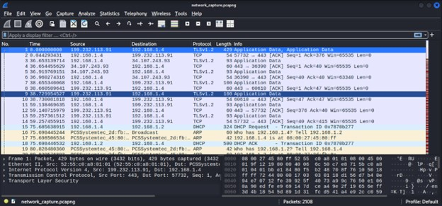
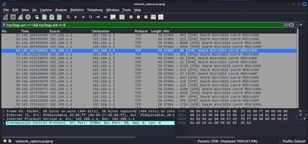

# Network Traffic Analysis Investigation

## Project Overview

This project demonstrates a basic network traffic investigation performed in a controlled cybersecurity lab environment. The objective of the project is to capture and analyze network packets in order to identify suspicious activity such as reconnaissance and port scanning attacks.

The investigation was conducted using Wireshark to capture network packets while performing a port scan from a Kali Linux machine targeting a Metasploitable system.

## Objective

The main objective of this project is to simulate the work of a security analyst investigating network traffic to detect potential attack patterns and suspicious communication between systems.

## Tools Used

The following cybersecurity tools were used:

- Kali Linux
- Wireshark
- Nmap
- Metasploitable
- Oracle VM VirtualBox

## Lab Environment

The investigation was performed in a virtual lab environment.

Attacker Machine  
Kali Linux

Target Machine  
Metasploitable

Virtualization Platform  
Oracle VM VirtualBox

The Kali Linux system was used to generate network traffic while the Metasploitable system served as the vulnerable target machine.

## Investigation Process

The investigation was performed in the following steps:

1. Set up a virtual lab using Kali Linux and Metasploitable.
2. Started packet capture using Wireshark on the Kali Linux machine.
3. Generated network scanning traffic using Nmap.
4. Captured and analyzed packets to identify suspicious traffic patterns.
5. Applied Wireshark filters to detect TCP SYN packets associated with port scanning.
6. Documented the findings in a structured network traffic investigation report.

## Key Findings

The packet analysis revealed multiple TCP SYN packets targeting several service ports on the target system. This behavior is consistent with a TCP SYN port scanning attack, which is commonly used by attackers during reconnaissance to discover open services on a target machine.

Several common service ports were targeted during the scan including:

- FTP (Port 21)
- SSH (Port 22)
- Telnet (Port 23)
- HTTP (Port 80)

Such scanning activity is often the first stage of a cyber attack where attackers attempt to identify vulnerabilities in exposed services.

## Project Structure
network-traffic-analysis
│
├── README.md
├── network_traffic_report.md
└── screenshots
  ├── wireshark_capture_start.jpg
  └── syn_scan_packets.jpg

## Screenshots

### Initial Packet Capture

### SYN Packet Analysis

## Investigation Report

A detailed analysis of the captured traffic is documented in the **network_traffic_report.md** file.

## Skills Demonstrated

- Network Traffic Analysis
- Packet Inspection
- Threat Detection
- Cybersecurity Investigation
- Security Reporting

## Author

Bhagya Nawarathna  
BSc (Hons) Information Technology (UG)  
University of Kelaniya
